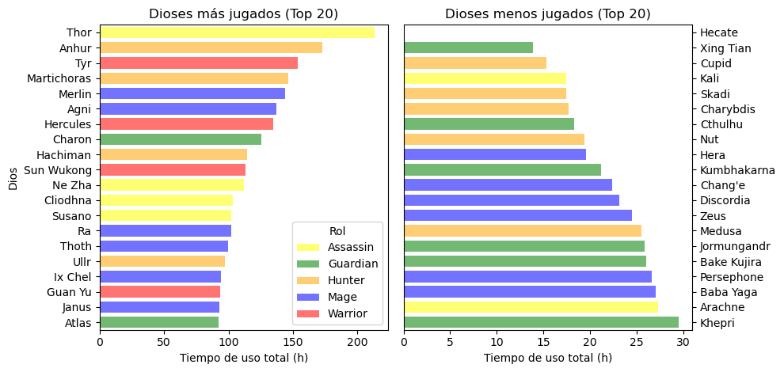
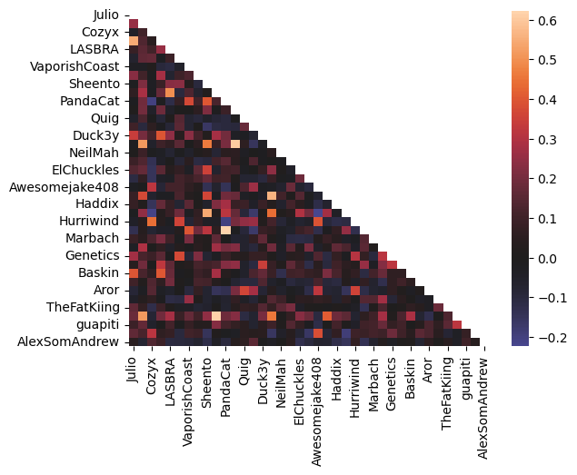
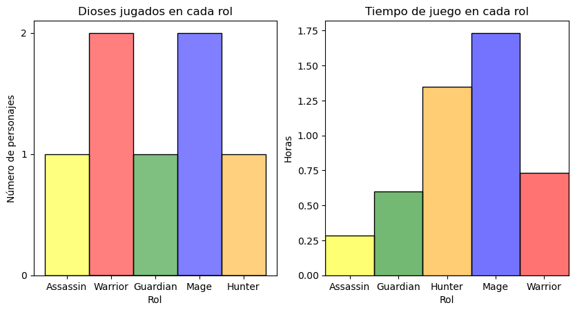
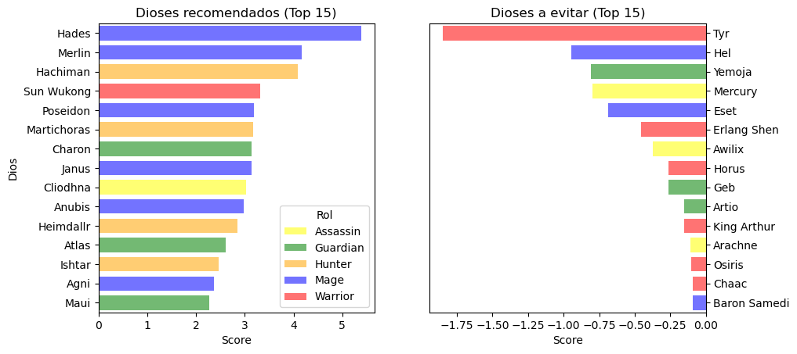

# ⚡ **Smite God Recommendation System** 🧠

This project combines data analysis and recommendation algorithms to enhance the player experience in Smite, a multiplayer online battle arena (MOBA) game in which players fight as gods. By leveraging collective intelligence, this system suggests the most suitable gods for players based on their gameplay preferences.

To do so, **Collaborative Filtering** techniques are applied, i.e. a god is recommended to a player based on the preferences of other players, ranging between similar to opposites. By analyzing gameplay patterns, the system tailors recommendations to enhance the gaming experience for both new and seasoned players.

---

## 📂 Dataset

The dataset was sourced from public player statistics on [Smite.guru](https://smite.guru) and focuses on the two most recent seasons of the game (Seasons 10 and 11 up to March 28th of 2024). Data preprocessing included:
- Filtering players with significant activity.
- Normalizing gameplay data across roles and gods.

---

## 🎯 Objective

To build a recommendation system that assists players by suggesting gods that align with their playstyle. Key goals include:
- **Personalized recommendations** for unlocking or purchasing gods.
- **Tailored free weekly choices** based on player preferences.
- **Enhanced decision-making** for new players exploring roles and playstyles.

---

## ⚙️ Approach

### 🔄 Data Collection and Processing
1. Scraped player data, including hours played per god.
2. Constructed a correlation matrix to analyze player similarities.
3. Filtered gods and players for meaningful insights.

### 🛠️ Recommendation System
- Used collaborative filtering to identify gods suited to individual preferences.
- Incorporated a scoring mechanism based on correlation weights and god popularity.
- Designed visualizations for evaluation and debugging.

---

## 🌟 Results

### Performance Insights
- **High accuracy** in recommending gods that matched player roles and styles.
- Effective in differentiating preferences, e.g., for specific roles (Mage vs. Warrior).

### Visual Outputs
#### Gods popularity:
Ranked gods by time played by player's sample.

#### Correlation Heatmap:
Highlights player similarities, forming the basis for recommendations.

#### Top Recommendations:
Ranked gods by affinity score, ensuring relevance to player preferences.

---

## 🔮 Future Improvements

- **Hi-Rez API Integration:** Real-time data to enhance accuracy.
- **Regional and Mode Customization:** Tailor recommendations by region and game mode.
- **Expanded Scope:** Add item recommendations and team composition suggestions.
